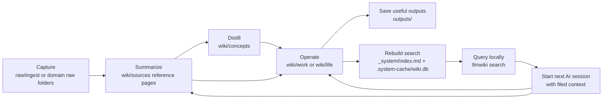

# AI Operating System Quickstart

A local-first Markdown workspace that gives AI tools a durable place to read, write, search, and hand off context for work or personal planning.

Most AI sessions fail for a simple reason: the model is asked to reason from scattered files, stale chat history, and partial memory. This quickstart gives the context a home. Raw material stays preserved, reusable knowledge gets written into a wiki, decisions have a clear place to land, and search can be rebuilt locally at any time.

The public package is safe by default. It ships folder guidance, placeholder files, and reusable templates, not real source files, private examples, local paths, company details, or personal history.

## Why This Exists

AI tools are useful at synthesis, drafting, review, and planning. They are weaker when every session starts from scratch.

An AI Operating System fixes that by making context durable:

- Capture source material once.
- Summarize it into reusable reference pages.
- Separate facts, decisions, concepts, plans, and outputs.
- Let AI tools read the same operating rules every time.
- Rebuild local search from Markdown instead of relying on opaque memory.
- Keep private work and personal context out of public templates.

The result is not a chatbot wrapper. It is a file-based operating layer for repeated AI-assisted work.

## How The System Works

The workspace has five jobs:

- `raw/` keeps original source material available for verification.
- `wiki/` holds the written knowledge future sessions should use.
- `brain/` defines the rules and writing style for humans and AI tools.
- `_system/` keeps the operating model, taxonomy, index, and change log.
- `tools/` and `checks/` provide local search and privacy-oriented validation.



The important pattern is capture -> summarize -> distill -> operate -> search -> reuse. Raw files are preserved, but the wiki becomes the normal reading surface for future work.

## Start A Workspace

Create a personal workspace:

```bash
npx create-ai-operating-system my-aos --personal
cd my-aos
```

Or create a work workspace:

```bash
npx create-ai-operating-system work-aos --work
cd work-aos
```

Read the rules, then build the index:

```bash
sed -n '1,120p' AGENTS.md
python3 tools/scripts/wiki_index.py rebuild
./tools/scripts/llmwiki status
```

## The Core Loop

1. Add real source material only in a private workspace.
2. Put new material in `raw/ingest/` until the right domain is clear.
3. Write a source reference page in `wiki/sources/`.
4. Move durable ideas into `wiki/concepts/`.
5. Record active work in `wiki/work/` or personal execution in `wiki/life/`.
6. Save useful drafts, reports, and checks in `outputs/`.
7. Rebuild search with `python3 tools/scripts/wiki_index.py rebuild`.
8. Query before starting from memory:

   ```bash
   ./tools/scripts/llmwiki search "decision log"
   ```

9. Run the privacy gate before sharing:

   ```bash
   ./checks/offline_check.sh
   ```

See [GUIDE.md](GUIDE.md) for a longer walkthrough.

## Reference Pages

Reference pages, or RPs, are the pages you want a future human or AI session to read before acting. They are short enough to scan, structured enough to search, and specific enough to avoid reopening raw files for routine questions.

This template uses three main kinds:

| RP type | Location | Purpose |
|---|---|---|
| Source RP | `wiki/sources/` | Summarizes one source and links back to `raw_ref` |
| Concept RP | `wiki/concepts/` | Captures reusable ideas, rules, frameworks, and recurring patterns |
| Operating RP | `wiki/work/` or `wiki/life/` | Records projects, decisions, meetings, goals, reviews, and plans |

A good source RP answers:

- What the source says.
- Why it matters.
- Which dates, numbers, decisions, or constraints matter.
- What is fact, inference, or recommendation.
- What should be checked again later.
- Where the raw source lives.

RPs are the handoff surface. Chat answers can be useful, but they are easy to lose. RPs turn useful answers into filed context.

## Why Local-First

Local-first means the primary workspace lives on disk as normal files. Markdown is the source of truth. SQLite search indexes and any future vector indexes are derived artifacts that can be deleted and rebuilt.

That choice matters for four reasons:

- **Privacy.** Real work and personal context can stay in a private clone, local folder, or encrypted drive.
- **Inspection.** Every important page is readable without a special app, account, or hosted service.
- **Portability.** Markdown works in a terminal, editor, notes app, Git repo, or file sync system.
- **Control.** You decide what gets committed, synced, shared, indexed, or sent to an AI model.

Local-first does not mean anti-cloud. You can still use hosted AI tools, file sync, or GitHub for public templates. The key rule is that the canonical knowledge stays in files you control.

## Search And Embeddings

The shipped search layer is local text search, not embeddings.

`tools/scripts/wiki_index.py` reads Markdown files, writes `_system/index.md`, and stores a rebuildable SQLite database at `.system-cache/wiki.db`. When SQLite FTS5 is available, `llmwiki search` uses full-text search. If FTS5 is not available, it falls back to a simpler text match.

No LLM or embedding model is required to use the package. The template does not call a cloud model, create embeddings, or send your files to an external service.

LLMs are useful in the workflow, but they are helpers:

- Summarize raw material into source RPs.
- Extract decisions, risks, and open questions.
- Rewrite a messy note into a clear wiki page.
- Search with `llmwiki`, then reason over the returned pages.
- Review the workspace before sharing.

Embeddings can be added later if you want semantic search. Keep them as a private extension:

- Store vectors under a derived folder such as `.vector/` or `.system-cache/`.
- Treat vectors as rebuildable, not canonical.
- Use a local embedding model when privacy matters.
- Use an approved hosted embedding service only when your data policy allows it.

The tradeoff is simple: SQLite text search is transparent, cheap, and easy to rebuild. Embeddings can find looser semantic matches, but they add model choice, storage, refresh, privacy, and debugging decisions.

## Folder Rationale

The file structure is opinionated because AI tools need predictable places to read and write.

| Path | Why it exists | Tradeoff |
|---|---|---|
| `AGENTS.md` | Gives AI tools the read order and workspace rules | Must stay current as the system changes |
| `brain/rules.md` | Defines lifecycle, privacy, and page rules | Too many rules can slow capture; keep them practical |
| `brain/voice.md` | Keeps generated writing consistent | Style guidance should not override factual clarity |
| `raw/` | Preserves original source material | Raw files can contain sensitive data; keep real raw content private |
| `wiki/sources/` | Turns sources into reusable RPs | Summaries need provenance and should not copy private raw content into public repos |
| `wiki/concepts/` | Holds ideas that survive beyond one source | Concepts can drift if they are not linked back to evidence |
| `wiki/work/` | Stores projects, meetings, decisions, and operating records | Work context usually has higher sharing risk |
| `wiki/life/` | Stores goals, routines, learning plans, decisions, and reviews | Personal context needs stricter privacy habits |
| `_system/` | Holds the operating model, taxonomy, index, and log | Generated index files should be rebuilt after material edits |
| `outputs/` | Saves drafts, reports, checks, and useful AI answers | Outputs are not canonical until promoted into `wiki/` |
| `tools/` | Provides local scripts for indexing and querying | Scripts stay small; advanced search is an extension |
| `checks/` | Runs smoke and privacy-oriented checks | Checks are guardrails, not a full privacy audit |

## Templates

| Template | Best for | Core pages |
|---|---|---|
| `work` | Projects, meetings, decisions, research, stakeholder context, operating reviews | Project page, decision log, meeting synthesis, project plan |
| `personal` | Goals, learning, routines, personal decisions, reviews, private research | Personal operating model, weekly review, learning plan, decision log |

The split matters. Work and personal systems have different risk profiles, review habits, and page types. Keeping them separate makes it easier to share one without exposing the other.

Both templates use mock descriptions and placeholders. They do not ship personal content, company names, project history, local install paths, raw PDFs, or private source summaries.

## Recommended Tools

The workspace is plain files, so no single app is required. These tools fit the model well:

- **Obsidian** for browsing Markdown, backlinks, graph views, and wiki-style navigation.
- **A code editor** for bulk edits, file search, and structured refactors.
- **A terminal** for `llmwiki`, `rg`, Git, smoke checks, and indexing.
- **Git** for versioning the template or a private workspace.
- **An AI coding agent** for summarizing sources, updating RPs, checking privacy risk, and carrying context across tasks.
- **Optional local model tooling** if you later add private embeddings or local summarization.

Use the simplest setup first: Markdown files, the included SQLite search, and one editor you already trust.

## Design Decisions

- **Markdown is canonical.** Search databases, generated indexes, and vectors are rebuildable.
- **Raw files stay separate.** Original material remains available for verification, but the wiki is the normal operating layer.
- **The public template is generic.** Real content belongs in a private clone.
- **Work and personal templates stay separate.** They need different privacy boundaries and review habits.
- **Search starts simple.** Text search is easier to inspect and debug than a hidden semantic index.
- **AI tools get explicit rules.** `AGENTS.md` reduces drift by telling tools what to read first and where to write.
- **Outputs are a staging area.** A useful answer becomes durable only when promoted into `wiki/`.

## Privacy

The public package is intentionally generic.

Do not publish:

- Employer, client, customer, partner, personnel, project, or deal details.
- Local machine paths.
- Private raw documents.
- Source summaries copied from your private workspace.
- Emails, phone numbers, addresses, identity documents, financial account data, health details, API keys, tokens, or screenshots.

Use real content only in a private clone. Run `./checks/offline_check.sh` before sharing, and treat the result as a guardrail rather than a guarantee.

## Credits

Built with inspiration from:

- Andrej Karpathy's LLM Wiki idea file: <https://gist.github.com/karpathy/442a6bf555914893e9891c11519de94f>
- Nate Jones' Open Brain / OB1 project: <https://github.com/NateBJones-Projects/OB1>

## Local Development

```bash
npm test
npm run smoke
npm pack --dry-run
node bin/create-ai-operating-system.js .tmp/demo --work --force
```

## License

Apache-2.0
